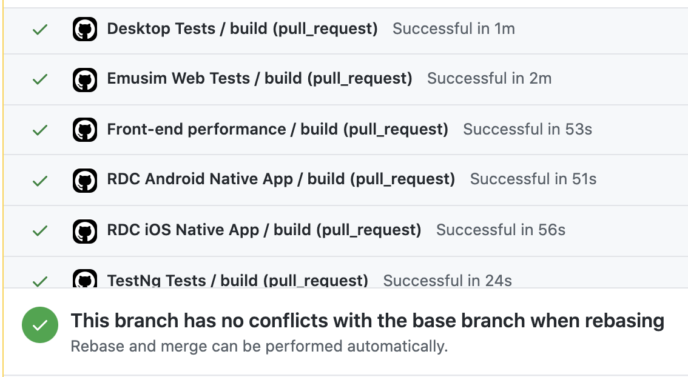

# Adding Code To demo-java

1. Clone this repository

**Working on your first Pull Request?** You can learn how from this *free* series [How to Contribute to an Open Source Project on GitHub](https://kcd.im/pull-request)

2. Decide if your code example is an example (most likely) or a best-practice (least common)
3. Add your code to the correct folder structure as specified below
4. Push your changes to the remote repository
5. Create a PR
6. Make sure that all the checks pass



7. Request someone to be a reviewer (@nadvolod or @joshmgrant are a good start)

An **example** is some code that wants to demonstrate a feature. 
For example, parallelization with JUnit4, parallelization with
Junit5,
biometric authentication, simple Appium iOS test. An **example** is as simple as it gets.
If you're creating a simple test to show off Sauce Labs, don't
add page objects for example.

> The primary goal is to keep maintenance costs as low as possible!

A **best-practice** is solution that shows off
how to use a specific technology combination in the optimal way
to test applications, according to the Solution Architects team. Typically there is
only a single best practice for web and for mobile. 
A **best-practice** will show:
* POs, 
* proper folder structure, 
* correct parallelization, 
* correct abstractions,
* use of all Sauce testing types (visual, perf, visual component) where applicable
**best-practice** code is not as common as code **examples**.

* **best-practice** for web exists [here](./best-practice)
* **best-practice** for mobile native exists [here](./best-practice-mobile-native)

## Add relevant code

### Repository Structure

The correct repository structure is:

```text
Description
-----------------
Most of the code that we will ever create is an "example"

|-- demo-java
    |-- appium-examples (Java module)
    |-- best-practice (Java module)
    |-- best-practice-mobile-native (Java module)
    |-- selenium-cucumber-examples (Java module)
    |-- selenium-examples (Java module)
    |-- selenium-junit4-examples (Java module)
    |-- selenium-testng-examples (Java module)
```

```text
Specific Structure With Examples
--------------------------------
|-- demo-java
    |-- best-practice (Java module)
        |-- src
            |-- main
            |-- test
                |-- java
                    |-- com.saucedemo
                        |--pages
                            |--BasePage.java
                            |--LoginPage.java
                            |-- ...
                        |--tests
                            |--DesktopTests.java
                            |--PerformanceTests.java
                            |--RealDeviceWebTests.java
                            |-- ...
    |-- best-practice-mobile-native
    |-- selenium-examples (Java module)
        |-- src
            |-- test
                |-- java
                    |-- com.saucedemo.selenium
                        |-- accessibility
                            |-- ...
                        |-- demo
                            |-SaucebindingsJunitTest.java
                            |-SeleniumTest.java
                        |-- login
                            |-- ...
                        |-- PerformanceTest.java
    |-- selenium-cucumber-examples (Java module)
        |-- ...
    |-- appium-examples (Java module)
        |-- src
            |-- main
            |-- test
                |-- java
                    |-- com.saucedemo.emusim (Java package)
                        |-- SomeEmusimExample.java
                    |-- com.saucedemo.realdevice (Java package)
                        |-- SomeRealDeviceExample.java
                    |-- com.saucedemo.realdevice.legacy (Java package)
                        |-- ...
```

## FAQs

### What are examples?

**examples** are a way to show off some feature in Sauce Labs.
Every time we add an example, please be sure to add it to the main README.

### Why is there only one best-practice folder?

With the evolution of Sauce, a true Best Practice is not only
Selenium automation. A true Best Practice shows customers
how to utilize all of the tools (Selenium, Appium, Visual, Performance, API...)
that Sauce has to offer in a cohesive framework
and test strategy.

### Why should I separate my code in this manner?

The key ideas behind this organization are visibility and 
reusability for the clients and the team. A mature customer may need
a performance testing code example using Junit5. On the other
hand, a less mature, but very valuable customer may need the 
same exact code sample but using Junit3. If we create
this code sample for one of the customers, wouldn't it
also be nice to make these visible to all other customers
that desire a specific combination of technologies?

But where would such code examples go? 

In the above structure that's easy for everyone to understand.

### Why does Cucumber get its own module?

Because the organization of the Cucumber source code is
different than the typical organization of a Maven project.
As a result, Cucumber needs it's own module where everything
is separated to meet Cucumber standards.

Also, Cucumber doesn't have a Best Practice as we don't
believe that it is one nor does our team have a Best Practice strategy
developed.

### But I don't want to create a code example for 10 different technologies!

There is no requirement to have a code **example** for every single tech combination.

Only create what's needed at the time. 
All we ask is that if you create a code example for one client
using a specific combination of technologies (ex Junit3 test status reporting), 
then make
that available to all customers, SAs, and SEs. 

Let your work be reusable and visible for the future instead
of being hidden somewhere in a private repository. It's highly
likely that there is a customer, or an engineer that's 
spending time recreating a code sample that you already 
created in your private repo.

### How will someone find my beautiful code sample?

There are code examples that are popular 
(Getting started samples) and there are code examples that
aren't so popular (using Junit3 to update test status).

If you feel that your code example needs to be front and
center then simply add it to the main [README](README.md).
We would be happy to see your excellent code there 😁
