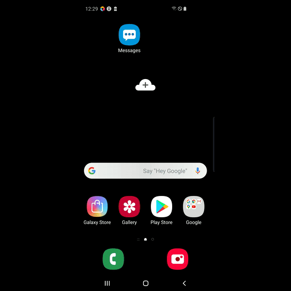

# Using Uploading and Downloading Files from Sauce Labs Android Real Devices
This folder contains examples for using up / download files from:

- [Android Real Devices in the Sauce Labs Cloud](#run-tests-on-sauce-labs-android-real-devices)

> **NOTE:**\
> Up/downloading files to iOS real devices is not supported by Appium!    

> **NOTE:**\
> Make sure you are in the folder `appium-app-examples` when you execute the commands to run the tests

## Important information
### Up/downloading files to and or from Android real devices
The market of Android is being controlled by a lot of different vendors, this also means a lot of different file structures 
where to upload your file to or download the file from. This makes it a challenge to determine which folder on the device you 
need to have.
You can check the location if you are using the Virtual USB offering of Sauce Labs for Private devices, 
see also [this video](https://youtu.be/hUaVj6WmqRA).

The advice is that you use a dedicated device, so you always know the file structure and don't need to over complicate 
the up/downloading script.

### Apps to verify up/downloads
For Android real devices we use the Samsung Gallery.  
The purpose is not to show you how to automate these apps, but more to show you how you can verify if an upload was successful.  

### Environment variables for Sauce Labs
The examples in this repository that can run on Sauce Labs use environment variables, make sure you've added the following

    # For Sauce Labs Real devices in the New UI
    export SAUCE_USERNAME=********
    export SAUCE_ACCESS_KEY=*******
    
## Uploading files
### Android Real devices
The script on how to use this can be found [here](./UploadImageToAndroidRealDevice.java) and the execution 
will look like this

## Run tests on Sauce Labs Android real devices
If you want to run the tests on Sauce Labs real Android devices then you can run the Android test with

    // If using the US DC
    mvn clean test -Dtest=DownloadImageFromAndroidRealDevice -Dregion=us
    mvn clean test -Dtest=UploadImageToAndroidRealDevice -Dregion=us
    
    // If using the EU DC
     mvn clean test -Dtest=DownloadImageFromAndroidRealDevice -Dregion=eu
     mvn clean test -Dtest=UploadImageToAndroidRealDevice -Dregion=eu
The tests will be executed on a Samsung Galaxy S9.

## Special Thanks
This example is based on [this webdriverio example](https://github.com/saucelabs-training/demo-js/tree/main/webdriverio/appium-app/examples/up-download-file)
from [Wim Selles](https://github.com/wswebcreation).
